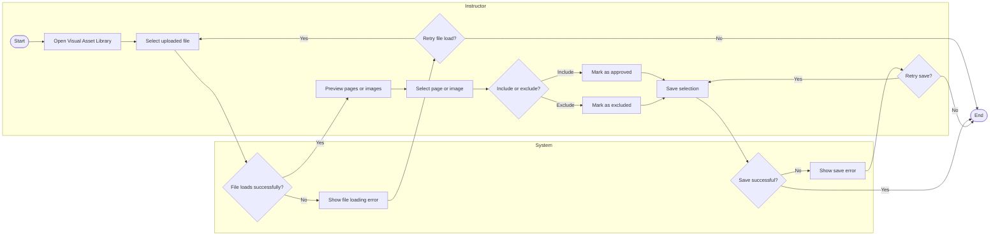

# Specification Phase Exercise

A little exercise to get started with the specification phase of the software development lifecycle. In this exercise, your team specifies a set of improvements and new features for [The Slide Machine](https://theslidemachine.com) — see the [instructions](instructions.md) for detail, and the [background](background.md) for an introduction to the software product you are tasked with extending.

## Team members

Sihao(Jacky) Chen || https://github.com/Abyssjac

Jessie Zhang || https://github.com/jessiezhang218

Xinyu Sun || https://github.com/Sinu112

Shiqi Wang || https://github.com/ShiqiWang1115

## Review of the Current Application

### Strengths

1. Strength — Responsive live transcription and generation. In my test, the system understood spoken input reliably and generated slides quickly enough to keep up with the lecture flow, without noticeable delay.

2. Strength — Sharing permissions are clearly explained. The Privacy & Sharing page clearly separates Public and Restricted access and explains what each option means. It also allows an instructor to give a specific person Viewer access, making it easy to understand who can open the lecture deck.

3. Strength — Clear upload feedback. Uploaded files show “Processing” or “Ready,” an extracted-text preview, and a “Use” checkbox. Instructors can confirm when a file is available for use.

### Weaknesses

4. Weakness — Flat and difficult-to-scan file selection. Files are presented together in a single dropdown list rather than in a structured browsing view. As the number of uploaded files grows, locating and selecting the intended asset becomes confusing.

5. Weakness — List View does not give a clear overview of the whole deck. My test lecture generated four slides, but after switching to List View, I still saw large individual slides instead of a compact overview or thumbnails of all four slides at once. This made it harder to quickly understand the structure of the deck or move to a specific slide.

6. Weakness — Generated slide content can be repetitive. In my generated "Race strategy elements" slide, one bullet said "The undercut," while the next bullet explained "The undercut: pit earlier to use fresh tires and gain time." The two bullets repeated the same idea, so the generated deck may still require manual cleanup before it is ready to share.

7. Weakness — No direct access to source PDFs during lectures. Although three uploaded PDFs were marked “Ready” and “Use,” the lecture view offered no obvious way to open them. Instructors must consult the originals in a separate window.

### Gaps

8. Gap — No source traceability for generated slides. After a slide is generated, the interface does not clearly show which uploaded file, image, or PDF page was used. This makes it difficult for instructors to verify whether the AI selected the intended course material.

9. Gap — Asset control is limited to the file level. Instructors can enable or disable an uploaded file, but there is no clear way to include or exclude specific pages or images within that file. This limits control when only part of a document is relevant to a lecture.

10. Gap — No asset usage history. Uploaded materials do not show where or whether they have been used in previous lectures or slides. This makes it harder to intentionally reuse visuals or avoid unnecessary repetition.

11. Gap — No search or filtering for uploaded materials. Instructors must scan filenames to locate a specific figure, with no visible controls to narrow a growing file list.

12. Gap — No grouping by chapter, topic, or lecture unit. The Dropbox integration lacks project-specific folders and tags/groups for individual images, while reference materials appear in one flat list. This makes it difficult to identify visuals for a lecture topic or direct the AI to the right sources.

## Prior Art & Originality

The existing specification already supports uploaded seed documents and images, image captions and keywords, editing and enabling or disabling seed assets, preferred images for concepts, and AI selection of seeded images whose captions or keywords match a slide topic. The roadmap identifies this seeding and image-guidance work as completed. Our proposal therefore does not claim ownership of basic upload, keyword-based matching, or seeded-image prioritization.

Our original contribution is a clearer asset-management and selection workflow for instructors: a dedicated, visual Asset Library for organizing project materials into Collections and searchable tags, together with a separate Select Seed Material screen for choosing the approved subset of assets for one lecture. The proposal adds per-asset AI-use guidance, such as preferred, reference-only, and instructor-written usage notes, and makes the instructor's selected lecture-specific asset set visible before generation begins. This extends the existing project-level seeding model without replacing its storage, extraction, preflight, or image-enrichment behavior.

## Stakeholders

### Instructor SQ
**User type:** Instructor

**Goals / needs**
- Reuse trusted course materials across lectures without repeatedly finding or uploading them.
- Organize materials by topic or lecture before slide generation begins.
- Make sure AI uses correct material and generates correct slides.
- Distinguish preferred visuals from reference-only materials so the AI uses each appropriately.
- Verify the original source behind generated slide content.

**What works well**
- The AI responds quickly enough to keep pace with the lecture.
- Automatic slide generation saves instructors the time and effort of creating slides manually.

**Problems / frustrations**
- AI-generated slides sometimes contain inaccuracies that instructors must check and correct before presenting.
- A flat asset list makes relevant materials difficult to find.
- A simple “Use” checkbox does not explain how the AI should use a material.
- It is difficult to confirm which materials the AI will use before generation.
- AI-generated slides sometimes omit important concepts or examples from the course materials.
- Generated slides do not clearly link back to their original files or pages.

### Student Yifei C
**User type:** Student

**Goals / needs**
- Find and select relevant materials easily when preparing slides.
- See key concepts and learning objectives clearly emphasized.

**Problems / frustrations**
- Selecting source materials feels cumbersome.
- Slide organization and emphasis can obscure main points.

### Student Runmei L
**User type:** Student

**Goals / needs**
- Use generated slides and quizzes to support review.
- Have a backup record when unable to take notes.

**Problems / frustrations**
- Quiz questions sometimes focus on minor details.
- Occasional inaccuracies make the student reluctant to replace personal notes with generated slides.

## Product Vision Statement

For instructors using The Slide Machine, the Visual Asset Library enables them to visually organize, annotate, and control approved course assets so that AI-generated slides use accurate, relevant visual materials that meet their teaching needs.

## User Requirements

### Instructor User Stories

1. As an instructor, I want to add approved course images, PDFs, videos, and links to a visual asset library, so that I can keep the materials I want the AI to use in one place.

2. As an instructor, I want to see the supported file types and size limits before uploading an asset, so that I know whether my material can be accepted before I spend time uploading it.

3. As an instructor, I want to edit the name, collection, and AI usage notes of an existing course asset and add or edit its searchable tags, so that the material stays organized and easy to find and the AI knows how I want it to be used.

4. As an instructor, I want to see which source asset was used for each generated slide, so that I can verify the slide is based on the correct course material.

5. As an instructor, I want to include or exclude specific pages or images within an uploaded file, so that I can control which parts of the material the AI may use.

6. As an instructor, I want to compare multiple candidate visuals before selecting one for a slide, so that I can choose the most appropriate visual for the concept I am teaching.

7. As an instructor, I want to open and preview my uploaded PDFs and images from the lecture screen, so that I can check the original material while teaching.

8. As an instructor, I want to pin a specific figure as the source for my next slide while teaching, so that I can respond to the discussion without searching through settings.

9. As an instructor, I want to open the original page behind a generated slide, so that I can check a number, formula, or explanation when a student asks about it.

10. As an instructor, I want to preview a source privately before showing it to students, so that I can check that it is the right page and does not contain material I did not intend to display.

11. As an instructor, I want to organize course materials by topic or lecture and search within them, so that I can quickly find the right source instead of scanning a long file list.

## Activity Diagrams

### Instructor edits an existing course asset before a lecture

**User Story:** As an instructor, I want to edit the name, collection, and AI usage notes of an existing course asset and add or edit its searchable tags, so that the material stays organized and easy to find and the AI knows how I want it to be used.

### Manage Individual Assets Within an Uploaded File

**User Story:** As an instructor, I want to include or exclude specific pages or images within an uploaded file, so that I can control which parts of the material the AI may use.

### Instructor organizes and selects assets before a lecture

**User Story:** As an instructor, I want to organize course materials by topic or lecture and search within them, so that I can quickly find the right source instead of scanning a long file list.

## Wireframes

https://www.figma.com/design/9UYnN5XWkhG3QWic3gFSlU/SEP1_Diagram?node-id=0-1&t=Wk8TG86xifjVClxl-1

## Clickable Prototype

https://www.figma.com/proto/9UYnN5XWkhG3QWic3gFSlU/SEP1_Diagram?node-id=17-134&p=f&t=ilFyfYvrElYG41Mb-1&scaling=contain&content-scaling=fixed&page-id=0%3A1

## Stakeholder Demo

https://theslidemachine.com/d/untitled-bbcc48a5

## Exit Ticket

https://docs.google.com/forms/d/e/1FAIpQLSeSXmzbLfBoyxdXc86BOqVBbmrbjythSHBWGFGst3RyUQFEZA/viewform
