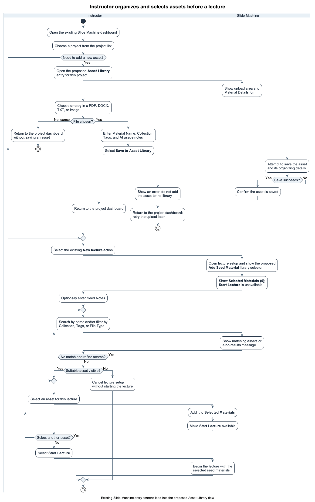

# Specification Phase Exercise

A little exercise to get started with the specification phase of the software development lifecycle. In this exercise, your team specifies a set of improvements and new features for [The Slide Machine](https://theslidemachine.com) — see the [instructions](instructions.md) for detail, and the [background](background.md) for an introduction to the software product you are tasked with extending.

## Team members

Sihao(Jacky) Chen || https://github.com/Abyssjac

Shiqi Wang || https://github.com/ShiqiWang1115

## Review of the Current Application

1 Weakness — Limited Dropbox asset organization. The Dropbox integration does not let instructors organize uploaded assets into project-specific folders or attach tags/groups to individual images. This makes it difficult to identify which visual material is appropriate for a particular lecture topic.

2 Gap — No discoverable style library. During use, I could not find a clear library for selecting or managing slide styles. Generated slides appeared to default to an NYU-style presentation format, with limited visible control over the visual style.

3 Weakness — Flat and difficult-to-scan file selection. Files are presented together in a single dropdown list rather than in a structured browsing view. As the number of uploaded files grows, locating and selecting the intended asset becomes confusing.

4 Strength — Responsive live transcription and generation. In my test, the system understood spoken input reliably and generated slides quickly enough to keep up with the lecture flow, without noticeable delay.

5 Strength — Clear upload feedback. Uploaded files show “Processing” or “Ready,” an extracted-text preview, and a “Use” checkbox. Instructors can confirm when a file is available for use.

6 Weakness — No direct access to source PDFs during lectures. Although three uploaded PDFs were marked “Ready” and “Use,” the lecture view offered no obvious way to open them. Instructors must consult the originals in a separate window.

7 Gap — No search for uploaded materials. Instructors must scan filenames to locate a specific figure.

8 Gap — No filters for uploaded materials. The file list offers no visible filtering controls, making relevant materials harder to find as the library grows.

9 Gap — No grouping by chapter, topic, or lecture unit. Materials appear in one flat list, making it harder to direct the AI to the correct sources.

10 Gap — No page-level PDF thumbnails. The list shows only filenames and extracted-text snippets, making visually recognizable figures difficult to locate.

## Prior Art & Originality

The existing specification already supports uploaded seed documents and images, image captions and keywords, editing and enabling or disabling seed assets, preferred images for concepts, and AI selection of seeded images whose captions or keywords match a slide topic. The roadmap identifies this seeding and image-guidance work as completed. Our proposal therefore does not claim ownership of basic upload, keyword-based matching, or seeded-image prioritization.

Our original contribution is a clearer asset-management and selection workflow for instructors: a dedicated, visual Asset Library for organizing project materials into Collections and searchable tags, together with a separate Select Seed Material screen for choosing the approved subset of assets for one lecture. The proposal adds per-asset AI-use guidance, such as preferred, reference-only, and instructor-written usage notes, and makes the instructor's selected lecture-specific asset set visible before generation begins. This extends the existing project-level seeding model without replacing its storage, extraction, preflight, or image-enrichment behavior.

## Stakeholders

### Student Yifei C
**User type:** Student

**Goals / needs**
- Find and select relevant materials easily when preparing slides.
- See key concepts and learning objectives clearly emphasized.

**Problems / frustrations**
- Selecting source materials feels cumbersome.
- Slide organization and emphasis can obscure main points.

### Student Runmei L
**User type:** Student

**Goals / needs**
- Use generated slides and quizzes to support review.
- Have a backup record when unable to take notes.

**Problems / frustrations**
- Quiz questions sometimes focus on minor details.
- Occasional inaccuracies make the student reluctant to replace personal notes with generated slides.

## Product Vision Statement

For instructors using The Slide Machine, the Visual Asset Library enables them to visually organize, annotate, and control approved course assets so that AI-generated slides use accurate, relevant visual materials that meet their teaching needs.

## User Requirements

1.As an instructor, I want to open and preview my uploaded PDFs and images from the lecture screen, so that I can check the original material while teaching.

2.As an instructor, I want to organize course materials by topic or lecture and search within them, so that I can quickly find the right source instead of scanning a long file list.

3.As an instructor, I want to pin a specific figure as the source for my next slide while teaching, so that I can respond to the discussion without searching through settings.

4.As an instructor, I want to open the original page behind a generated slide, so that I can check a number, formula, or explanation when a student asks about it.

5.As an instructor, I want to preview a source privately before showing it to students, so that I can check that it is the right page and does not contain material I did not intend to display.

## Activity Diagrams

2.As an instructor, I want to organize course materials by topic or lecture and search within them, so that I can quickly find the right source instead of scanning a long file list.

## Wireframes

https://www.figma.com/design/9UYnN5XWkhG3QWic3gFSlU/SEP1_Diagram?node-id=0-1&t=Wk8TG86xifjVClxl-1

## Clickable Prototype

https://www.figma.com/proto/9UYnN5XWkhG3QWic3gFSlU/SEP1_Diagram?node-id=17-134&p=f&t=ilFyfYvrElYG41Mb-1&scaling=contain&content-scaling=fixed&page-id=0%3A1

## Stakeholder Demo

See instructions. Delete this line and place a link to the deck The Slide Machine generated during your presentation here, after you have presented.

## Exit Ticket

See instructions. Delete this line and place a link to the exit-ticket quiz you generated from your demo deck and distributed to the class, along with a short note on what — if anything — you had to correct in the generated questions before publishing.
