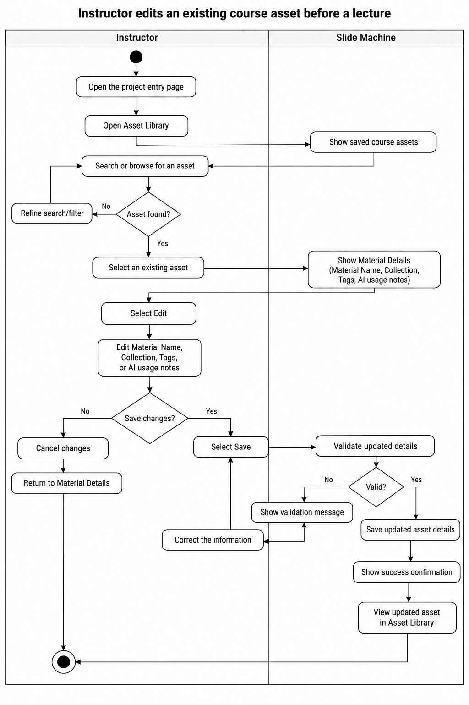

# Specification Phase Exercise

A little exercise to get started with the specification phase of the software development lifecycle. In this exercise, your team specifies a set of improvements and new features for [The Slide Machine](https://theslidemachine.com) — see the [instructions](instructions.md) for detail, and the [background](background.md) for an introduction to the software product you are tasked with extending.

## Team members

Sihao(Jacky) Chen || https://github.com/Abyssjac

Jessie Zhang || https://github.com/jessiezhang218

Xinyu Sun || https://github.com/Sinu112

## Review of the Current Application

1 Weakness — Limited Dropbox asset organization. The Dropbox integration does not let instructors organize uploaded assets into project-specific folders or attach tags/groups to individual images. This makes it difficult to identify which visual material is appropriate for a particular lecture topic.

2 Gap — No discoverable style library. During use, I could not find a clear library for selecting or managing slide styles. Generated slides appeared to default to an NYU-style presentation format, with limited visible control over the visual style.

3 Weakness — Flat and difficult-to-scan file selection. Files are presented together in a single dropdown list rather than in a structured browsing view. As the number of uploaded files grows, locating and selecting the intended asset becomes confusing.

4 Strength — Responsive live transcription and generation. In my test, the system understood spoken input reliably and generated slides quickly enough to keep up with the lecture flow, without noticeable delay.

5 Weakness — Some navigation controls are difficult to understand at first. Several controls on the lecture page are shown mainly as icons without visible text labels. During my first use, I had to hover over or try the icons to figure out functions such as List View. This makes basic navigation less obvious for a first-time instructor.

6 Weakness — List View does not give a clear overview of the whole deck. My test lecture generated four slides, but after switching to List View, I still saw large individual slides instead of a compact overview or thumbnails of all four slides at once. This made it harder to quickly understand the structure of the deck or move to a specific slide.

7 Weakness — Generated slide content can be repetitive. In my generated "Race strategy elements" slide, one bullet said "The undercut," while the next bullet explained "The undercut: pit earlier to use fresh tires and gain time." The two bullets repeated the same idea, so the generated deck may still require manual cleanup before it is ready to share.

8 Strength — Sharing permissions are clearly explained. The Privacy & Sharing page clearly separates Public and Restricted access and explains what each option means. It also allows an instructor to give a specific person Viewer access, making it easy to understand who can open the lecture deck.

9 Gap — No source traceability for generated slides. After a slide is generated, the interface does not clearly show which uploaded file, image, or PDF page was used. This makes it difficult for instructors to verify whether the AI selected the intended course material.

10 Gap — Asset control is limited to the file level. Instructors can enable or disable an uploaded file, but there is no clear way to include or exclude specific pages or images within that file. This limits control when only part of a document is relevant to a lecture.

11 Gap — No asset usage history. Uploaded materials do not show where or whether they have been used in previous lectures or slides. This makes it harder to intentionally reuse visuals or avoid unnecessary repetition.

12 Gap — No way to compare candidate visuals. The interface does not provide a side-by-side view of multiple images or PDF pages before selection. Instructors therefore have to inspect materials individually when deciding which visual best fits a slide.

## Prior Art & Originality

The existing specification already supports uploaded seed documents and images, image captions and keywords, editing and enabling or disabling seed assets, preferred images for concepts, and AI selection of seeded images whose captions or keywords match a slide topic. The roadmap identifies this seeding and image-guidance work as completed. Our proposal therefore does not claim ownership of basic upload, keyword-based matching, or seeded-image prioritization.

Our original contribution is a clearer asset-management and selection workflow for instructors: a dedicated, visual Asset Library for organizing project materials into Collections and searchable tags, together with a separate Select Seed Material screen for choosing the approved subset of assets for one lecture. The proposal adds per-asset AI-use guidance, such as preferred, reference-only, and instructor-written usage notes, and makes the instructor's selected lecture-specific asset set visible before generation begins. This extends the existing project-level seeding model without replacing its storage, extraction, preflight, or image-enrichment behavior.

## Stakeholders

See instructions. Delete this line and replace with the name(s) of the stakeholder(s) you interviewed and lists showing their goals/needs, and problems/frustrations. Note which type of user each stakeholder represents. You may use pseudonyms or partial names to maintain their privacy, but you must privately share their full names and contact information as part of your submission of this exercise

## Product Vision Statement

For instructors using The Slide Machine, the Visual Asset Library enables them to visually organize, annotate, and control approved course assets so that AI-generated slides use accurate, relevant visual materials that meet their teaching needs.

## User Requirements

### Instructor User Stories

1. As an instructor, I want to add approved course images, PDFs, videos, and links to a visual asset library, so that I can keep the materials I want the AI to use in one place.

2. As an instructor, I want to see the supported file types and size limits before uploading an asset, so that I know whether my material can be accepted before I spend time uploading it.

3. As an instructor, I want to edit the name, collection, tags, and AI usage notes of an existing course asset, so that the material stays organized and the AI knows how I want it to be used.

4. As an instructor, I want to add searchable tags to my assets, so that I can quickly find the right visual by topic, concept, or lecture later.

5. As an instructor, I want to see which source asset was used for each generated slide, so that I can verify the slide is based on the correct course material.

6. As an instructor, I want to include or exclude specific pages or images within an uploaded file, so that I can control which parts of the material the AI may use.

7. As an instructor, I want to see where an asset has been used in previous lectures or slides, so that I can reuse visuals intentionally and avoid unnecessary repetition.

8. As an instructor, I want to compare multiple candidate visuals before selecting one for a slide, so that I can choose the most appropriate visual for the concept I am teaching.

## Activity Diagrams

### Instructor edits an existing course asset before a lecture

**User Story:** As an instructor, I want to edit the name, collection, tags, and AI usage notes of an existing course asset, so that the material stays organized and the AI knows how I want it to be used.

## Wireframes

https://www.figma.com/design/9UYnN5XWkhG3QWic3gFSlU/SEP1_Diagram?node-id=0-1&t=Wk8TG86xifjVClxl-1

## Clickable Prototype

https://www.figma.com/proto/9UYnN5XWkhG3QWic3gFSlU/SEP1_Diagram?node-id=17-134&p=f&t=ilFyfYvrElYG41Mb-1&scaling=contain&content-scaling=fixed&page-id=0%3A1

## Stakeholder Demo

See instructions. Delete this line and place a link to the deck The Slide Machine generated during your presentation here, after you have presented.

## Exit Ticket

See instructions. Delete this line and place a link to the exit-ticket quiz you generated from your demo deck and distributed to the class, along with a short note on what — if anything — you had to correct in the generated questions before publishing.
